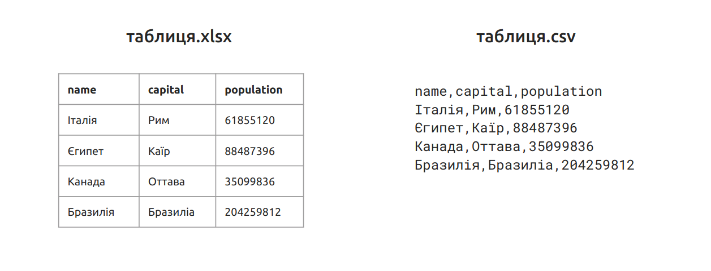

# Відкриті дані для громад: вступ до відкритих даних для органів місцевого самоврядування

**Автор:** [Богдан Тишкевич](mailto:b.tyshkevych@gmail.com), аналітик, консультант ГО "Агенція журналістики даних" (програма "Прозорість та підзвітність у держуправлінні та послугах")

Матеріали курсу ліцензовано на умовах [Ліцензії Creative Commons Із Зазначення Авторства 4.0 Міжнародна](https://creativecommons.org/licenses/by/4.0/legalcode.uk).

Матеріали курсу доступні в Google-документі за [посиланням](https://docs.google.com/document/d/1Nf4_VRGAJe6HQxzWK-5dNaQGBJF1kz64ioXlRtp1Gs8/edit?usp=sharing).

## Про курс
Дані оточують нас скрізь. Ваша громада має власний веб-сайт. Його вміст розміщується на серверах органу місцевого самоврядування або в сервісі-хмарі. Бюджет громади формується в спеціальному програмному забезпеченні. Воно зберігає паспорти, формує розписи, тощо. Бухгалтери вносять інформацію про платіжки й договори на [Єдиний державний портал використання публічних фінансів](https://spending.gov.ua/web/guest). Закупівельники працюють з [Prozorro](https://prozorro.gov.ua/). Схема планування території громади — це також дані.

Мета цього курсу — зрозуміти, що таке відкриті дані та зробити вступ до політики відкритих даних.

Відкриті дані вже змінюють міста. Наприклад, Львів впровадив [Telegram-бота](https://t.me/lviv_city_helper_bot), завдяки якому можна дізнаватися про життя міста, Кропивницький інформує мешканців про [видалення зелених насаджень](http://texty.org.ua/d/2018/trees/), Вінниця аналізує [швидкість реакції комунальних служб на виклики](http://texty.org.ua/d/varta_vin/), Дрогобич [удвічі збільшив надходження від розміщення зовнішньої реклами](https://www.epravda.com.ua/publications/2018/08/1/639163/) та поліпшив інвестиційний клімат. Розвиваються сервіси [Rada4You](https://www.oporaua.org/104-analicity/45354-pro-shcho-lokalnyi-servis-rada4you), [Прозоро.Продажі](https://prozorro.sale/), [Відкритий бюджет](https://www.openbudget.in.ua/), [Є-ліки](https://eliky.in.ua/).

Для чого громаді та органу місцевого самоврядування потрібні відкриті дані? На це питання існує щонайменше три відповіді:
1.  прозорість та підзвітність, виконання положень [Закону України "Про доступ до публічної інформації"](https://zakon.rada.gov.ua/laws/show/2939-17), [Постанови КМУ від 21 жовтня 2015 р. № 835](https://zakon0.rada.gov.ua/laws/show/835-2015-%D0%BF);
1.  впровадження нових електронних сервісів на основі відкритих даних;
1.  прийняття обґрунтованих управлінських рішень.

Працюючи над цим курсом ми не намагались зібрати всю можливу інформацію в одному місці. До кожного підрозділу додані корисні посилання, за якими можна знайти детальну інформацію.

**Корисні посилання**
1.  [Data-монстр з Львівщини: як Дрогобич навчився наповнювати бюджет з даних](https://www.epravda.com.ua/publications/2018/08/1/639163/)
1.  [Чому необхідні відкриті дані міста](https://biz.nv.ua/ukr/experts/chomu-neobhidni-vidkriti-dani-mista-2015829.html)
1.  [Цифровой лев: как во Львове создают полезные Open Data сервисы](https://tech.liga.net/superdata/article/tsifrovoy-lev-kak-vo-lvove-sozdayut-poleznye-open-data-servisy)
1.  [Зеленый Кропивницкий. Зачем город стал играть в открытую](https://tech.liga.net/superdata/article/zelenyy-kropivnitskiy-zachem-gorod-stal-igrat-v-otkrytuyu)
1.  [Наказано вижити. Як відкриті дані допомагають у великому місті](https://focus.ua/opinions/400691/)


## 1. Що таке відкриті дані?
Визначення поняття "відкриті дані" наведене в [Законі України "Про доступ до публічної інформації" (стаття 10)](https://zakon.rada.gov.ua/laws/show/2939-17).

**Публічна інформація у формі відкритих даних** — це публічна інформація у форматі, що дозволяє її автоматизоване оброблення електронними засобами, вільний та безоплатний доступ до неї, а також її подальше використання.

Для того щоб зрозуміти це визначення краще, розіб'ємо його на окремі частини:
1.  **"публічна інформація"** — це інформація, що отримується, створюється або зберігається місцевою радою, її виконавчим органом, структурними підрозділами, комунальними підприємствами, установами;
1.  **"у форматі, що дозволяє її автоматизоване оброблення електронними засобами"** — як правило, це формати електронних таблиць (XLS, XLSX, ODS) і машиночитаних файлів (CSV, XML, JSON). Якщо набори оприлюднені таким чином, то їх дані легко обробляти і поєднувати між собою. І навпаки, скановані документи (PDF, JPEG) і текст (DOC, DOCX, ODT) майже неможливо обробити автоматично;
1.  **"вільний та безоплатний доступ до неї"** —  для того щоб завантажити відкриті дані, не потрібно реєструватись, використовувати BankID або електронний цифровий підпис, тощо; відкриті дані надаються безкоштовно;
1.  **"а також її подальше використання"** — відкриті дані можна вільно поєднувати з іншими даними, використовувати у комерційних продуктах, наприклад, інтернет-магазині.

Таким чином, відкриті дані — це інформація органів місцевого самоврядування та інших розпорядників. Вона оприлюднюються у формі, яка полегшує подальше використання: аналіз, візуалізацію, завантаження у бази даних веб-сайтів та мобільних застосунків.

Розпорядники забов'язані оприлюднювати відкриті дані на [Єдиному державному веб-порталі відкритих даних](https://data.gov.ua/) та власних веб-сайтах (стаття 10 [Законі України "Про доступ до публічної інформації"](https://zakon.rada.gov.ua/laws/show/2939-17)). Перелік наборів, які необхідно оприлюднювати на Єдиному державному веб-порталі відкритих даних, визначений у [Постанові КМУ від 21 жовтня 2015 р. № 835](https://zakon0.rada.gov.ua/laws/show/835-2015-%D0%BF).

[Постанова КМУ від 21 жовтня 2015 р. № 835](https://zakon0.rada.gov.ua/laws/show/835-2015-%D0%BF) визначає 6 принципів, якими треба керуватися під час оприлюднення відкритих даних: (1) відкритість за замовчуванням; (2) оперативність і вичерпність; (3) доступність і готовність до використання; (4) порівнюваність та можливість поєднання з іншими даними (інтероперабельність); (5) для кращого врядування та участі громадськості; (6) для інклюзивного розвитку та інновацій.

1.  **Відкритість за замовчуванням.** Принцип відкритості за замовчуванням передбачає презумпцію відкритості даних. Вся публічна інформація є відкритою, за винятком випадків визначених законодавством. Розпорядники мають проактивно відкривати нові набори. При цьому необхідно забезпечити захист персональних даних й іншої інформації з обмеженим доступом.
1.  **Оперативність і вичерпність.** Цінність відкритих даних полягає в їх актуальності. Тому, важливо оперативно оновлювати дані якнайшвидше після змін. У випадку транспортних даних, зміни можуть відбуватися в режимі реального часу. Відкриті дані мають оприлюднюватись у первинній, незведеній і максимально деталізованій формі. Це забезпечить їх вичерпність.
1.  **Доступність і використання.** Доступність та використання відкритих даних мають декілька аспектів. Перш за все, оприлюднення даних на порталах у машиночитаних форматах дає можливість для їх автоматизованого збору та обробки. По-друге, користувачі мають легко знаходити необхідну інформацію. Дані мають бути безкоштовними та мати відкриті ліцензії.
1.  **Порівнюваність та можливість поєднання з іншими даними (інтероперабельність).** Можливість комбінувати та поєднувати різні види даних значно підвищує їх цінність. Для цього дані мають бути порівнювані та підготовлені до поєднання з іншими даними. Наприклад, містити коди ЄДРПОУ, мати однакові формати значень та виміри одиниць вимірювання.
1.  **Для кращого врядування та участі громадськості.** Відкриті дані — наріжний камінь прозорості та підзвітності. Завдяки впровадженню електронних сервісів стає можливим ефективніше залучення громадян для прийняття управлінських рішень. 
1.  **Для інклюзивного розвитку та інновацій.** Відкриті дані сприяють інклюзивному економічному розвитку та інноваціям. Наприклад, підприємці можуть створювати нові ІТ-продукти на основі даних ([International Open Data Charter](https://opendatacharter.net/principles/)).

<p align="center"><i>Таблиця 1 — Приклади інформації, яка відповідає та не відповідає формі відкритих даних</i></p>

НЕ є відкритими даними|Є відкритими даними
--- | ---
Скановані форми звітності в форматах PDF, JPEG.|Форми звітності в форматі електронних таблиць XLS, XLSX, ODS.
Онлайн-мапа зонування території громади.|Просторові дані, що містяться в ГІС у форматі SHP.
Електронний сервіс (веб-сайт), який допомагає керувати комунальним майном громади.|Доступ до бази даних завдяки відкритому інтерфейсу прикладного програмування (API).
Перелік контактів у документі DOC або на сторінці сайту.|Електронна таблиця (XLS, XLSX, ODS), що містить перелік структурних підрозділів, посадових осіб та їх контактні дані.


**Корисні посилання**
1.  [Електронний навчальний курс про відкриті дані](http://tapas.learndata.info/)
1.  [Нормативно-правова база для організації роботи з відкритими даними](https://data.gov.ua/uploads/files/2018-08-11-104314.216325Part01.pdf) (Рекомендації Державного агентства з питань електронного урядування)
1.  [Налагодження інфраструктури відкритих даних](https://data.gov.ua/uploads/files/2018-08-11-104320.561709Part02.pdf) (Рекомендації Державного агентства з питань електронного урядування)
1.  [Три кроки до якісних відкритих даних: законодавство, захист персональних даних, трискладовий тест](https://docs.google.com/presentation/d/1kQJV2mM7E-ZUYZpEVVgZ3uqAErv7-AAvPmEzmQW810w/edit?usp=sharing)


## 2. Які дані має оприлюднювати орган місцевого самоврядування
[Постанова КМУ від 21 жовтня 2015 р. № 835](https://zakon0.rada.gov.ua/laws/show/835-2015-%D0%BF) визначає **34 набори відкритих даних**, які мають оприлюднювати органи місцевого самоврядування на [Єдиному державному порталі відкритих даних](https://data.gov.ua/). Наприклад, перелік об'єктів комунальної власності; перелік об'єктів комунальної власності, що передані в оренду чи інше право користування; інформація про використання публічних коштів під час будівництва, ремонту та реконструкції об'єктів дорожньої інфраструктури; паспорти бюджетних програм місцевого бюджету; перелік перевізників, що надають послуги пасажирського автомобільного транспорту, і маршрути перевезення; схеми планування територій громад і плани зонування територій; та інші. 

Крім цього, існують **12 наборів відкритих даних**, які мають оприлюднювати всі розпорядники, відповідно до повноважень. Це, наприклад, довідник підприємств, установ (закладів) та організацій; інформація про організаційну структуру; звіти, в тому числі щодо задоволення запитів на інформацію; переліки регуляторних актів; та інші. Розпорядники можуть на власний розсуд відкривати й інші набори, якщо на них надходять запити від громадськості, представників ЗМІ або бізнесу ([пункт 5 Положення](https://zakon0.rada.gov.ua/laws/show/835-2015-%D0%BF)).

Орган місцевого самоврядування має вести облік публічної інформації та відкритих даних. Щоб зрозуміти, які набори даних перебувають у його розпорядженні, необхідно провести аудит даних. **Аудит даних** — це дослідження публічної інформації, зокрема, визначення наявності наборів, їх стану, форматів інших характеристик. Також під час аудиту може вивчатися те, яким чином дані створюються, збираються, зберігаються й поширюється. За результатами роботи складається реєстр наборів даних та рекомендації щодо їх оприлюднення.

Для проведення аудиту найкраще сформувати робочу групу, що включатиме спеціалістів відповідальних за ІТ-забезпечення, доступ до публічної інформації, документообіг й діловодство. Детальні інструкції щодо проведення аудиту доступні за [посиланням](https://data.gov.ua/uploads/files/2018-08-11-104328.578029Part03.pdf).

**Корисні посилання**

1.  [Закон України "Про доступ до публічної інформації"](https://zakon.rada.gov.ua/laws/show/2939-17)
1.  [Постанова КМУ "Про затвердження Положення про набори даних, які підлягають оприлюдненню у формі відкритих даних" від 21 жовтня 2015 р. № 835 ](https://zakon0.rada.gov.ua/laws/show/835-2015-%D0%BF)
1.  [Аудит даних](https://data.gov.ua/uploads/files/2018-08-11-104328.578029Part03.pdf) (Рекомендації Державного агентства з питань електронного урядування)


## 3. Формати відкритих даних
У пункті 9 [Постанови КМУ №835](https://zakon0.rada.gov.ua/laws/show/835-2015-%D0%BF) визначені такі типи даних: текстові, структуровані, геопросторові, графічні, відео- та аудіодані та інші. Ми розглянемо три перші типи, які є найбільш поширеними. 


### З.1. Текстові дані
Текстові дані складаються переважно параграфів тексту, заголовків, реквізитів документів, тощо. Вони можуть включати таблиці та зображення. Прикладами текстових даних є розпорядчі документи місцевої ради, її виконавчого органу й посадових осіб (рішення, розпорядження), положення, програми, звіти, угоди.

Для роботи з текстовими даними найчастіше використовуються редактори Microsoft Word, LibreOffice Writer, Google Документи. Текстові дані необхідно оприлюднювати у форматах DOC, DOCX, ODT, TXT, RTF, PDF (з текстовим змістом, нескановане зображення), або на веб-сторінках (HTML).


### 3.2. Структуровані дані
До структурованих даних належать таблиці та ієрархічні дані, які містяться в базах даних. Це найбільш цінний формат відкритих даних, оскільки їх легко автоматично оброблювати.

<p align="center"><i>Рисунок 1 — Порівняння звичайної таблиці та CSV-файлу</i></p>



Електронні таблиці оприлюднюється у форматах XLS, XLSX, ODS. Для роботи з ними використовується Microsoft Excel, LibreOffice Calc, Google Таблиці. Іншим поширеним форматом для публікації таблиць є CSV (англ. comma separated values — значення, що розділені комою). Цей формат використовується для обміну даними між різним програмним забезпеченням. Як показано на рисунку 1, кожен рядок у CSV файлі відповідає рядку в таблиці, а значення відділяються по колонках розділювачем — комою.

Детальніше про оприлюднення таблиць у формі відкритих даних можна дізнатися у презентації ["Три кроки до якісних відкритих даних: машиночитані дані, структура, паспорт набору даних"](https://docs.google.com/presentation/d/1gGdRCfba65LOTyxMTnDRABa7MTglMkOmmscyaRs6Lcc/edit?usp=sharing) та методичних матеріалах ["Відкриті дані: формати і правила створення"](https://drive.google.com/open?id=1tynMpBcorkj9QWNx2nRfihkOFYPXURVV), ["Стандарти відкритих даних місцевого самоврядування"](https://mods.readthedocs.io/uk/latest/).

<p align="center"><i>Рисунок 2 — Схематичне зображення структури файлу JSON</i></p>

```
{
  "size": 1000,
  "count": 2311,
  "moreThenCount": false,
  "documents": [
    {
      "id": 1450996651,
      "edrpou": "04051327",
      "documentNumber": "390",
      "documentDate": "2018-10-19",
      "signDate": "2018-11-02",
      "signature": {
        "caAddress": "ca.informjust.ua"
      },
      "amount": 2325.07,
      "currency": "UAH",
      "currencyAmountUAH": 0,
      "contractors": [
        {
          "identifier": "00182857",
          "contractorType": 2,
          "name": "ВОЛИНСЬКЕ ОБЛСПЕЦРЕМБУД ПІДПРИЄМСТВО ПРОТИПОЖЕЖНИХ РОБІТ",
          "firstName": "Г.",
          "lastName": "ЗАГОРОДНІЙ",
          "middleName": "І.",
          "address": {...}
        }
      ],
      "fromDate": "2018-10-19",
      "toDate": "2018-12-31",
      "subject": "ПРОВЕДЕННЯ РОБІТ З ТЕХНІЧНОГО ОБСЛУГОВУВАННЯ ВОГНЕГАСНИКІВ",
      "noTerm": false,
      "pdvInclude": true,
      "pdvAmount": 387.51,
      "tender": false,
      "reason": "ч.1 ст. 2 закону України Про державні закупівлі",
      "specifications": [],
      "isCpvVat": false,
      "procurementItems": []
    },
    {...},
    {...},
    ...
    {...}
  ]
}

```

Для завантаження наборів на портал відкритих даних достатньо використовувати формати електронних таблиць - XLS, XLSX, ODS. Якщо ж ви вирішили скористатися CSV, необхідно врахувати, що **CSV-файли збережені в Microsoft Excel не відповідають стандартам відкритих даних**. Вони містять специфічне кодування та використовують як розділювач крапку з комою замість коми. Передперегляд таких файлів на data.gov.ua неможливий.

Google Таблиці є кращим інструментом для збереження CSV. Для цього необхідно відкрити XLS або XLSX файл через меню **Файл > Відкрити або Імпорт** та завантажити необхідний аркуш таблиці через **Файл > Завантажити як > Значення, розділені комами (.csv, поточний аркуш).**

До структурованих належать також формати JSON і XML. Вони мають ієрархічну структуру (див. рисунок 2) і часто використовуються для передачі даних в мережі Інтернет. Наприклад, можна легко [отримати звітність та договори зі spending.gov.ua і оприлюднити їх на data.gov.ua](https://github.com/tapas-opendata/spendingToData). Також ієрархічно структуровані дані у [Prozorro](https://prozorro.gov.ua/openprocurement), [Інспекційному порталі](http://api.ias.brdo.com.ua/v1_1/manual), [Єдиному державному реєстрі юридичних осіб, фізичних осіб-підприємців та громадських формувань](https://data.gov.ua/dataset/1c7f3815-3259-45e0-bdf1-64dca07ddc10). Для того, щоб обробляти та аналізувати такі набори потрібно мати навички програмування.


### 3.3. Геопросторові дані
Геопросторові дані описують положення географічних об'єктів на території. Наприклад, до геопросторових даних належить графічна частина планів зонування, генеральних планів та іншої містобудівної документації, супутникові знімки, дані інтерактивних мап, тощо. **Існує два типи геопросторових даних: векторні та растрові**. Векторні дані містять точки, лінії та полігони, з яких складаються складніші об'єкти на картах (будівлі, шляхи, зони). Найчастіше для їх збереження використовуються формати - SHP, GeoJSON, KML, MID, MIF, ХML. До растрових геопросторових даних належать супутникові знімки, ортофотоплани, тощо. Вони зберігаються у формті GeoTIFF та інших графічних форматах.

**Корисні посилання**
1.  [Відкриті дані: формати і правила створення](https://drive.google.com/open?id=1tynMpBcorkj9QWNx2nRfihkOFYPXURVV)
1.  [Стандарти відкритих даних місцевого самоврядування](https://mods.readthedocs.io/uk/latest/)
1.  [Три кроки до якісних відкритих даних: законодавство, захист персональних даних, трискладовий тест](https://docs.google.com/presentation/d/1kQJV2mM7E-ZUYZpEVVgZ3uqAErv7-AAvPmEzmQW810w/edit?usp=sharing)
1.  [Три кроки до якісних відкритих даних: машиночитані дані, структура, паспорт набору даних](https://docs.google.com/presentation/d/1gGdRCfba65LOTyxMTnDRABa7MTglMkOmmscyaRs6Lcc/edit?usp=sharing)
1.  [Як оприлюднити звітність та договори зі spending.gov.ua на data.gov.ua](https://github.com/tapas-opendata/spendingToData)
1.  [Підготовка даних до публікації](https://data.gov.ua/uploads/files/2018-08-11-104337.710875Part04.pdf) (Рекомендації Державного агентства з питань електронного урядування)
1.  [Довідник із поганих даних](http://texty.org.ua/pg/book/Oximets/read/90212?a_offset=)
1.  [Організація даних у таблицях](http://texty.org.ua/pg/book/Oximets/read/87136?a_offset=)


## 4. Портал відкритих даних
Відкриті дані, що визначені Постановою КМУ №835 необхідно розміщувати на Єдиному державному веб-порталі відкритих даних за адресою — [https://data.gov.ua/](https://data.gov.ua/). Якщо орган місцевого самоврядування вашої громади ще не немає облікового запису, необхідно пройти реєстрацію за [посиланням](https://data.gov.ua/pages/manager). 

Дані на порталі впорядковані по наборах. **Набір даних** — це зібрання даних, які оприлюднює та оновлює розпорядник. Набори складаються з ресурсів. **Ресурс** — файл для завантаження, веб-сервіс, що надає дані (API) або інша форма, у якій доступні дані набору. Якщо порівнювати портал відкритих даних з персональним комп'ютером, то портал відкритих даних — це, немов, жорсткий диск, набори даних — це папки, а ресурси — файли. Також набори включають паспорти та структуру. **Паспорт набору даних** — сукупність відомостей, що описують набір, наприклад, назва, дата оприлюднення, назва розпорядника, ім'я та адреса електронної пошти відповідальної особи, тощо. Паспорт формується під час створення набору. **Структура** — файл, що описує внутрішню побудову набору та ресурсів. Наприклад, у випадку таблиці, структура міститиме назви колонок, їх опис, типи даних.

**Корисні посилання**
1.  [Інструкція розпорядника інформації Єдиного державного веб-порталу відкритих даних](https://data.gov.ua/uploads/files/2018-08-27-090121.57665910.2.-.pdf)

## Тестування

**1. Який із запропонованих варіантів найкраще відображає зміст поняття відкриті дані?**

_Тип тесту: вибір однієї правильної відповіді_

а) публічна інформація про використання місцевого бюджету, його видатків та надходжень;

б) публічна інформація, що наявна в онлайн сервісах органів державної влади та місцевого самоврядування;

в) публічна інформація надана на запит фізичних та юридичних осіб через електронні засоби;

г) це публічна інформація, що оприлюднена у форматі для автоматизованої обробки;

**2. Яку адресу в мережі Інтернет має Єдиний державному веб-порталі відкритих даних?**

_Тип тесту: вибір однієї правильної відповіді_

а) [https://data.gov.ua/](https://data.gov.ua/)

б) [https://prozorro.gov.ua/](https://prozorro.gov.ua/)

в) [https://spending.gov.ua/](https://spending.gov.ua/)

г) [http://poslugy.gov.ua/](http://poslugy.gov.ua/)

**3. У якому з варіантів правильно визначені розпорядники відкритих даних в об'єднаній територіальній громаді?**

_Тип тесту: вибір однієї правильної відповіді_

а) мешканці громади, місцева рада, підприємства, що функціонують на території громади;

б) лише місцева рада, її виконавчий орган;

в) місцева рада, її виконавчий орган, структурні підрозділи, комунальні підприємства, установи;

г) підприємства, що функціонують на території громади, комунальні підприємства, установи;


**4. Що означає принцип відкритості за замовчуванням?**

_Тип тесту: вибір однієї правильної відповіді_

а) Органи місцевого самоврядування мають замовчувати інформацію з обмеженим доступом;

б) Вся публічна інформація є відкритою, за винятком випадків визначених законодавством. Розпорядники мають її активно оприлюднювати;

в) Розпорядники бюджетних коштів мають замовчувати інформацію про витрати коштів;

г) Відкриті дані — наріжний камінь прозорості та підзвітності. Вони роблять допомагають залучити громадян для прийняття важливих рішень.

**5. Що з переліченого НЕ належить до відкритих даних?**

_Тип тесту: вибір однієї правильної відповіді_

а) Інтерактивна карта розміщення та використання комунального майна;

б) Форми звітності комунального підприємства у форматі електронних таблиць XLSX;

в) Доступ до бази даних місцевого бюджету завдяки інтерфейсу прикладного програмування (API);

г) Генеральний план населеного пункту у форматі шейпфайлів (SHP).

**6. Яке з тверджень є правильним?**

_Тип тесту: вибір однієї правильної відповіді_

а) розпорядники публічної інформації забов'язані оприлюднювати на data.gov.ua відкриті дані лише добровільно;

б) розпорядники публічної інформації забов'язані оприлюднювати на data.gov.ua набори передбачені Постановою КМУ №835, а також інші набори, що становлять високий суспільний інтерес;

в) розпорядники забов'язані оприлюднювати лише набори передбачені Постановою КМУ №835;

г) розпорядники публічної інформації погоджують перелік наборів для оприлюднення на data.gov.ua з Державним агентством з питань електронного урядування.

**7. Які з типів даних є найбільш цінними для подальшого використання?**

_Тип тесту: вибір однієї правильної відповіді_

а) текстові (TXT, RTF, ODT, DOC, DOCX PDF, HTML);

б) Macromedia Flash застосунки (SWF, FLV);

в) аудіо та відеодані (MPEG, MKV, AVI, FLV, MP3, WAV, MKA);

г) структуровані (XLS, XLSX, ODS, CSV, JSON, XML).

**8. Яка головна мета аудиту даних?**

_Тип тесту: вибір однієї правильної відповіді_

а) визначення наявності наборів, їх стану, форматів інших характеристик;

б) визначення даних з обмеженим доступом у наборах з метою їх подальшого видалення;

в) визначення вразливості інформаційних систем розпорядників для захисту інформації від несанкціонованого доступу;

г) перевірка достовірності даних бухгалтерського обліку і показників фінансової звітності суб'єкта господарювання;

**9. Установіть відповідність між типами даних та їх прикладами**

_Тип тесту: встановлення відповідності_

а) Текстові

б) Структуровані

в) Просторові

(1) Графічна частина містобудівної документації, супутникові знімки;

(2) Розпорядчі документи, положення, програми, звіти, угоди;

(3) Переліки, реєстри, бази даних, звіти у формі таблиць;

(4) Веб-сервіси, інтерактивні карти, публікації на сайті, візуалізації даних.

**10. Установіть відповідність між терміном та визначенням:**

_Тип тесту: встановлення відповідності_

а) Паспорт набору даних

б) Ресурс

в) Набір даних

г) Структура

(1) Зібрання однотипних даних, які оприлюднює та оновлює розпорядник;

(2) Файл у машиночитаному форматі, що описує внутрішню будову набору та ресурсів;

(3) Сукупність відомостей, що описують набір, наприклад, назва, дата оприлюднення, назва розпорядника, ім'я та адреса електронної пошти відповідальної особи, тощо;

(4) Файл для завантаження, веб-сервіс, що надає дані (API) або інша форма, у якій доступні дані набору.
